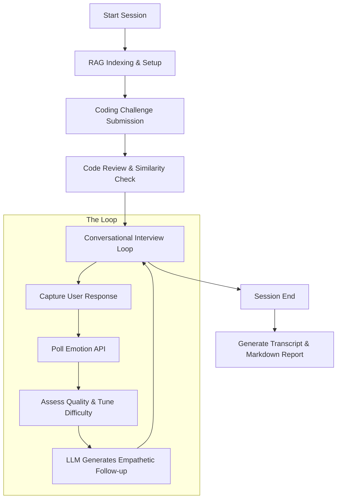

# 🧠 VIKA: Conversational AI Interview System - Project Overview

**VIKA** is a sophisticated, AI-driven technical interview platform designed to simulate a real-world human interviewer. It goes beyond simple Q&A by analyzing the candidate's code quality, emotional state, and adapting the interview difficulty in real-time.

---

## 🛠️ Tech Stack

### **Core Ecosystem**
*   **Language**: Python 3.10+
*   **AI Models**:
    *   **LLM**: Google Gemini (Pro 1.5 / Flash) for natural language reasoning and empathetic interaction.
    *   **Computer Vision**: YOLOv8 (Face Detection) + Custom TensorFlow/Keras CNN (Emotion Classification).
*   **Database**: SQLite (for real-time logging of emotion events and results).
*   **Web Framework**: Flask (REST API for exposing emotion detection data).

### **Key Libraries**
*   **Static Code Analysis**: `radon` (Complexity), `lizard` (Maintainability), `textdistance` (Similarity).
*   **Vector Search**: `faiss-cpu` (RAG - Retrieval-Augmented Generation for context-aware questions).
*   **Visualization**: `matplotlib`, `seaborn` (for final emotion trend reports).
*   **Dev Tools**: `python-dotenv`, `google-generativeai`, `opencv-python`.

---

## 🧩 Core Logic & Components

### 1. **The Interview Orchestrator ([main.py](file:///d:/Gayatri/Projects/Conversational_AI/main.py))**
The central hub that manages the session lifecycle. It handles:
*   Initial coding challenge delivery.
*   The conversation loop (Safety filter -> Emotion retrieval -> Difficulty tuning -> LLM Response).
*   Persistence of logs and final report generation.

### 2. **Emotion Detection System (`canfacemo/`)**
A specialized subsystem that runs independently via a Flask API.
*   **Input**: Real-time webcam feed.
*   **Logic**: Detects faces, crops them, pre-processes pixels, and predicts one of 7 emotions (Neutral, Happy, Sad, Anger, Fear, Disgust, Surprise).
*   **Feature**: Calculates a **Stress Score** (0-1) based on weighted negative emotions.

### 3. **Static Code Reviewer (`code_reviewer/`)**
Analyzes Python submissions without executing them.
*   **Complexity**: Measures control flow branches (Cyclomatic Complexity).
*   **Maintainability Index**: A composite score of human-readability.
*   **Similarity**: Uses AST (Abstract Syntax Tree) fingerprinting to compare the candidate's code against a reference solution.

### 4. **Adaptive LLM (`LLM/`)**
The "Brain" of VIKA.
*   **Safety Filter**: Blocks inappropriate language before it reaches the LLM.
*   **Context Awareness (RAG)**: Retrieves relevant interview examples from a FAISS index to ground the AI's questions.
*   **Emotional Empathy**: The prompt engineering injects the candidate's current emotion/stress into the Gemini instructions to adjust the AI's tone.

---

## 🔄 System Flow

---

## 🌟 Why These Features? (The "Why")

*   **Emotion-Awareness**: Traditional AI interviewers feel robotic. By monitoring stress, VIKA can pivot to easier questions if it detects the candidate is panicking, fostering a better candidate experience.
*   **AST Fingerprinting**: Simple string comparison fails if variables are renamed. AST-based similarity checks the *structure* of the logic, making it much harder to "trick" the system while allowing for creative solutions.
*   **RAG (Retrieval-Augmented Generation)**: Ensures the AI stays relevant to specific technical domains by grounding it in a database of high-quality interview content.
*   **Real-time Dashboards**: Providing a visual emotion trend allows HR teams to see *how* a candidate handles pressure, not just if they solved the problem.

---

## ⚠️ Important Info

*   **API Quota**: The system relies heavily on the Gemini API. Ensure `GOOGLE_API_KEY` in [.env](file:///d:/Gayatri/Projects/Conversational_AI/.env) has sufficient quota (billing may be required for Flash 2.0).
*   **Webcam Access**: The Emotion API requires physical webcam access. If running in a headless server, it will fallback to neutral defaults.
*   **Maintenance**: The `.conda` and `vika_env` directories are specific to current setups; use `temp_vika_env` if the primary environment is corrupted.
